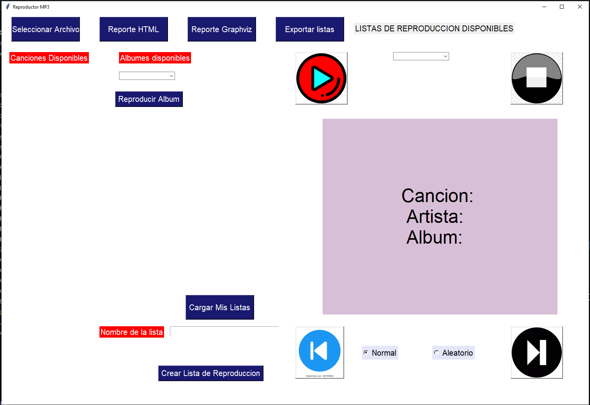
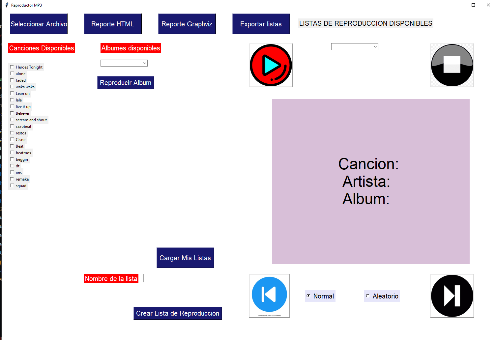
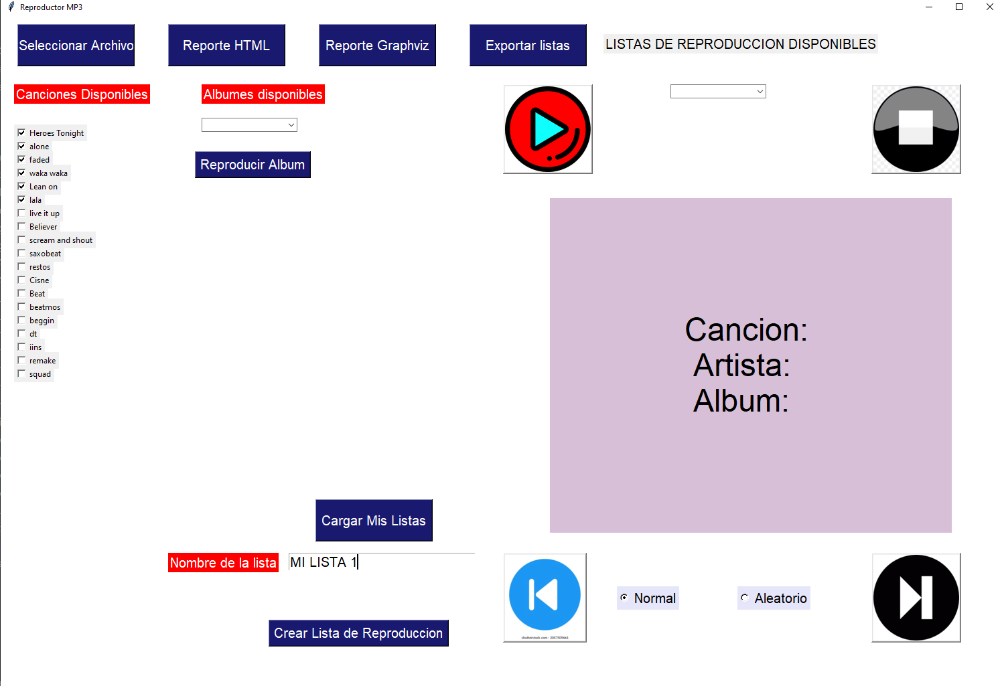
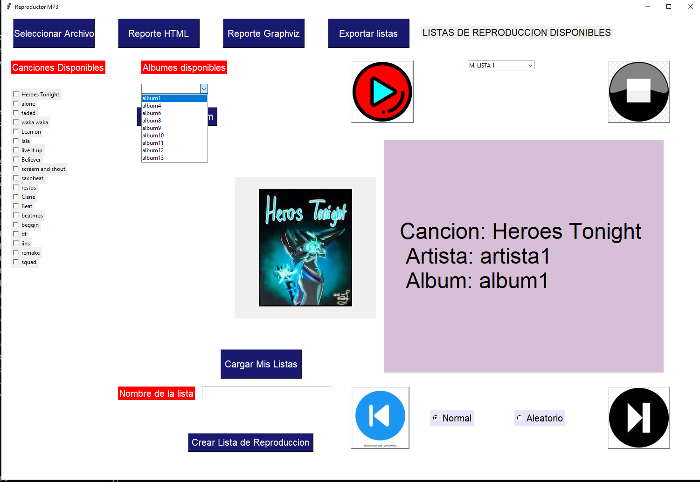
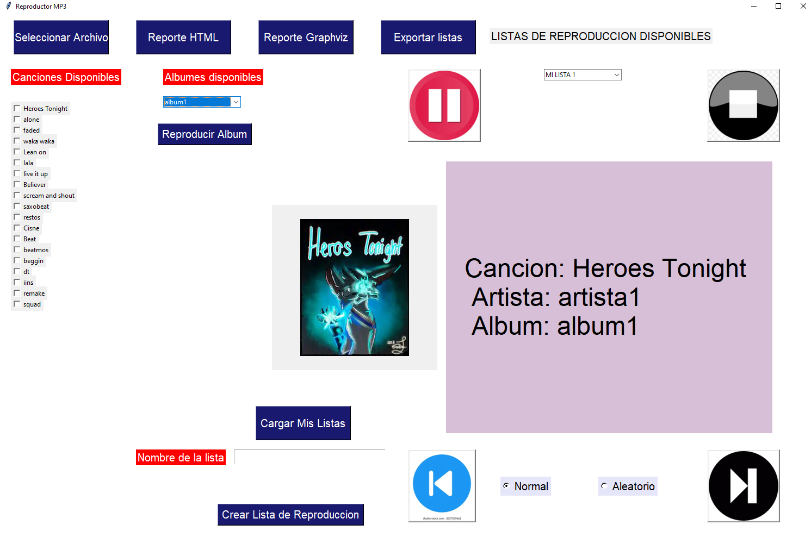
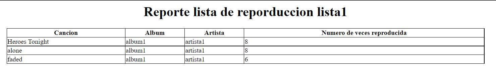
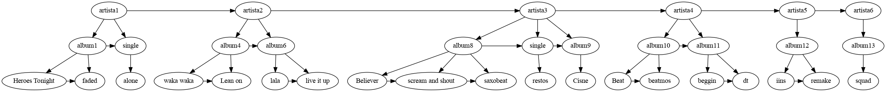

# **REPRODUCTOR DE MUSICA MP3 PROYECTO1 IPC2**
El reproductor fue desarrollado con el fin de implementar estructuras de datos, usando listas simplemente enlazadas y listas circulares.
___
Al iniciar la aplicación se ve de la siguiente forma:

___

## Seleccionar Archivo

Esta opcion abre un explorador de archivos para poder cargar un archivo, el archivo debe de ser en formato xml. A continuación se muestra un ejemplo de archivo

~~~xml
<?xml version="1.0" encoding="UTF-8"?>
<biblioteca>
    <cancion nombre="cancion1">
        <artista>"artista1" </artista>
        <album>"album51"</album>
        <imagen> "../Img/heroes.png"</imagen>
        <ruta>"../Musica/heroes.mp3"</ruta>
    </cancion>
    <cancion nombre="cancion4">,
        <artista>"artista2"</artista>
        <album> "album44"</album>,
        <imagen> "../Img/faded.png"</imagen>
        <ruta>"../Musica/waka.mp3"</ruta>
    </cancion>
  
    <cancion nombre="cancion8">,
        <artista>"artista38"</artista>
        <album> "album8"</album>,
        <imagen> "../Img/faded.png"</imagen>
        <ruta>"../Musica/faded.mp3"</ruta>
    </cancion>
    
</biblioteca>
~~~

___

Cuando se cargue el archivo se mostraran las canciones cargadas en la parte izquierda.

___

## Crear Lista de Reproducción

Para crear una lista de reproducción se deben de seleccionar las canciones, darle un nombre a la lista y presionar el boton con este nombre

Al estar creada lista esta aparecerá en el apartado de listas de reproducción disponibles.

Para reproducirla solo deberá seleccionarse y darlo al boton de play.

___

## Reproducir Album

Se debe de seleccionar un album y hacer click al boton reproducir album

___

## Reporte Html

Muestra un reporte como el siguiente acerca de las listas de reproducción.

___

## Reporte Graphviz

Muestra un grafo de como están las estructuras en memoria

___

## Exportar Listas

Exporta las listas de reproducción creadas por el usuario en un archivo xml, estás pueden ser cargadas nuevamente cuando se inicia el reproductor en la opción cargar listas de reproducción.

Ejemplo de archivo generado.

~~~xml
<?xml version="1.0" encoding="UTF-8"?>
<ListasReproducción>
   <Lista nombre="lista1">
   <cancion nombre="waka waka">
       <artista> artista2 </artista>
       <album> album4 </album>
       <vecesReproducidas> 8 </vecesReproducidas>
       <imagen> ../Img/faded.png </imagen>
       <ruta> ../Musica/waka.mp3 </ruta>
   </cancion>
   <cancion nombre="lala">
       <artista> artista2 </artista>
       <album> album6 </album>
       <vecesReproducidas> 5 </vecesReproducidas>
       <imagen> ../Img/faded.png </imagen>
       <ruta> ../Musica/lala.mp3 </ruta>
   </cancion>
   <cancion nombre="scream and shout">
       <artista> artista3 </artista>
       <album> album8 </album>
       <vecesReproducidas> 7 </vecesReproducidas>
       <imagen> ../Img/heroes.png </imagen>
       <ruta> ../Musica/scream.mp3 </ruta>
   </cancion>
   <cancion nombre="Cisne">
       <artista> artista3 </artista>
       <album> album9 </album>
       <vecesReproducidas> 3 </vecesReproducidas>
       <imagen> ../Img/heroes.png </imagen>
       <ruta> ../Musica/cisne.mp3 </ruta>
   </cancion>
   <cancion nombre="beatmos">
       <artista> artista4 </artista>
       <album> album10 </album>
       <vecesReproducidas> 3 </vecesReproducidas>
       <imagen> ../Img/heroes.png </imagen>
       <ruta> ../Musica/beatmos.mp3 </ruta>
   </cancion>
   <cancion nombre="iins">
       <artista> artista5 </artista>
       <album> album12 </album>
       <vecesReproducidas> 4 </vecesReproducidas>
       <imagen> ../Img/heroes.png </imagen>
       <ruta> ../Musica/iins.mp3 </ruta>
   </cancion>
    </Lista>
</ListasReproducción>

~~~
